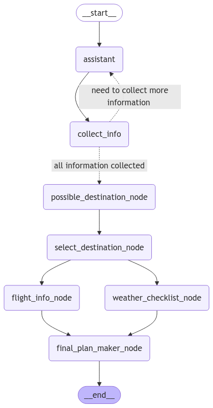

# Travel Planning AI Agent 🌍✈️

## Overview
This Travel Planning AI Agent is an intelligent system built using Langgraph that helps users plan their perfect trip. The agent interacts with users to understand their preferences and provides personalized travel recommendations along with detailed itineraries.

## LangGraph Flow Diagram


## Features
- Personal Information Collection
  - User name
  - Current city
  - Travel preferences (Adventure/Leisure)
  - Travel dates
  - Budget constraints

- Destination Recommendations
  - AI-powered destination suggestions based on user preferences
  - Multiple options to choose from

- Detailed Itinerary Generation
  - Day-by-day travel plans
  - Flight information using Google Flights API
  - Weather forecasts using AccuWeather API
  - Local attractions and activities

## How It Works
1. The agent collects user information through an interactive conversation
2. Based on the collected data, it suggests suitable destinations
3. Once the user selects a destination, it generates:
   - Comprehensive travel itinerary
   - Real-time flight options
   - Weather forecasts for the selected dates

## APIs Used
- Google Flights API - For real-time flight information
- AccuWeather API - For weather forecasts

## Getting Started
1. Clone the repository
2. Install required dependencies
3. Set up API keys for Google Flights and AccuWeather
4. Run the application

## Requirements
- Python 3.8+
- Langgraph
- API keys for Google Flights and AccuWeather

## Running the Application
### Backend
```bash
uvicorn main:app --reload
```
### Frontend
```bash
cd UI
streamlit run app.py
```

## Demo
<!--  -->
<video width="320" height="240" controls>
  <source src="TravelPlanningAgent.mp4" type="video/mp4">
</video>

> "Travel is not just about going to new places, it's about creating memories that last a lifetime." 🌎✨
